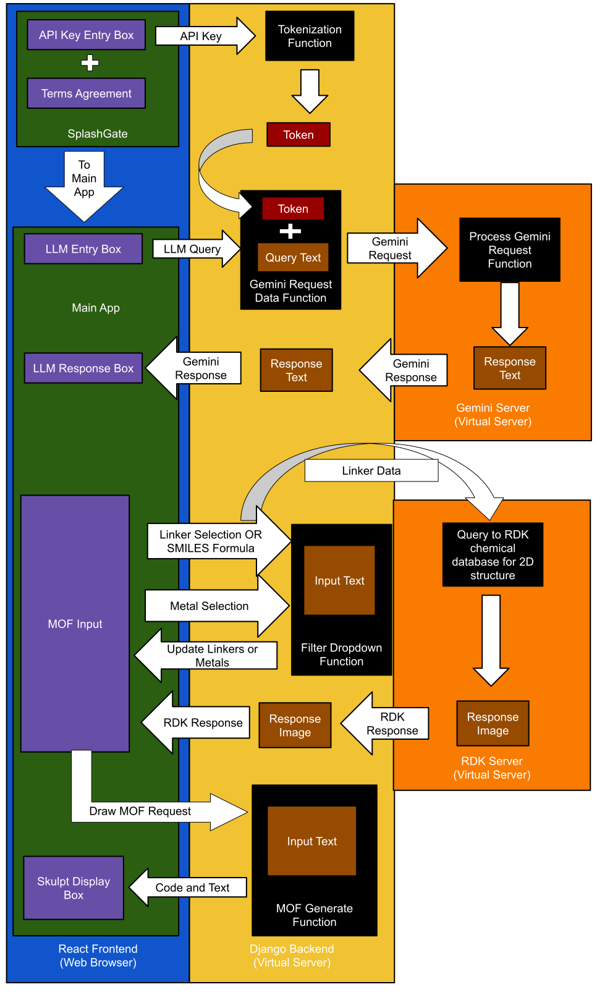
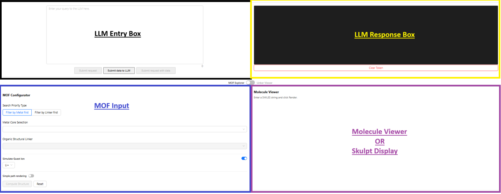
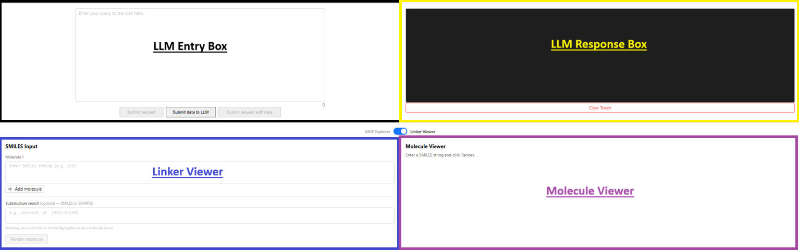
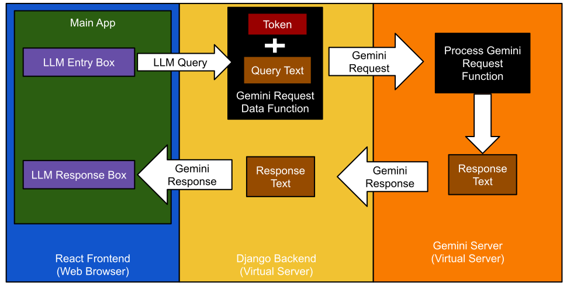
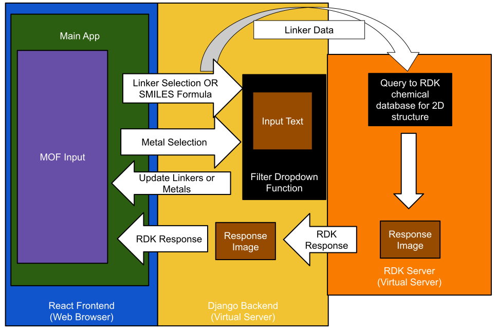
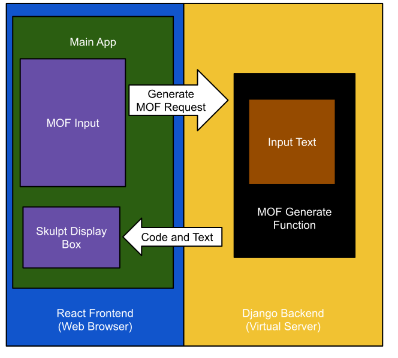

# LLM-Web-App
This educational tool supports students from 6th grade and up by demonstrating the benefits, drawbacks, and ethical considerations involved in using large language models (LLMs). It is strictly for educational use, specifically as a demonstration of AI's capabilities. This app is deployed via Render and can be viewed here [https://chem-llm-web-app-9s9h.onrender.com](https://chem-llm-web-app-9s9h.onrender.com). Please note that delays may occur with the Render deployment as the backend may need to spin up. To receive the best experience, try the app and if it does not start initially try again in 30-60 seconds.

## Table of Contents
1. [Description](#description)
    * [Language and Library Rationale](#language-and-library-rationale)
    * [React Frontend Orientation](#react-frontend-orientation)
    * [Django Backend Orientation](#django-backend-orientation)
2. [Installation](#installation)
5. [License](#license)
6. [Contributing](#contributing)
7. [Tests](#tests)
8. [Questions](#questions)

## Description
### Language and Library Rationale
This particular application has several moving parts to its operation. We will begin with its base structure: a React page written in TypeScript. I chose to use React as it is a modern framework that is well-supported with documentation and numerous libraries. React is written in JavaScript and its variations, such as TypeScript in this case, allowing for an app that is easy to update as the state variables change. React also allows the app to be scalable and device-responsive without a heavy reliance on Cascading Style Sheets (CSS). Documentation on React and how it works can be found here: [https://react.dev/](https://react.dev/).

The app is written in TypeScript as a way for me to impose strict typing requirements on JavaScript - a non-type safe language. TypeScript requires every variable declaration to have an associated type, much like Java or C-based languages require type prefixes. This allows me to catch variable type conflicts prior to running and deployment, resulting in more intentional code design. More on TypeScript can be found here: [https://www.typescriptlang.org/](https://www.typescriptlang.org/).

The app utilizes Google's Gemini API to send queries to and receive replies from Gemini. The app needed access to some style of LLM and Gemini was chosen due to its easy access to a free-tier operations. There are numerous models of Gemini, each with their own limits in terms of character count and number of requests per day, so the app will change which model it queries depending on model availability and if its limits are exceeded. The Gemini API documentation can be found here: [https://ai.google.dev/gemini-api/docs](https://ai.google.dev/gemini-api/docs)

Due to its reliance on Gemini, the app requires the user to have a valid Gemini API key. These can be obtained free of charge here: [https://makersuite.google.com/app/apikey](https://makersuite.google.com/app/apikey)  

The app provides visual data and common names for organic molecules using the Open-Source RDKit for React. Its documentation can be found here: [https://react.rdkitjs.com//](https://react.rdkitjs.com/).

The app also needs to generate two dimensional (2D) and three dimensional (3D) diagrams of Metal-Organic Frameworks (MOFs) for teaching purposes. To do this, Python is used to convert a submitted SMILES formula of an organic linker as well as a metal into Python code so the models can be drawn using Python's Turtle Graphics. The code to produce the drawings was developed for this project and resides on the Django server side of this application. However, to execute and display the Turtle drawing, a Skulpt Display [https://skulpt.org/](https://skulpt.org/) is used. Skulpt is a module that compiles Python into JavaScript, thus converting the inputted Python code into a Javascript form that can be run in the web browser.

A macro view of the interactions of this app can be seen in this diagram:

### React Frontend Orientation
The first page of the app is a "splashgate" that prevents users from interacting with the main page until two pieces of data are collected. 

Firstly, the terms and conditions of the app must be agreed to. This app is meant for educational use only, with the intention that the educators will use it as a demonstration for their class to be guided through. Currently, many LLMs require users to be 18 or older. As a result, the user needs to agree that they meet and will follow the Gemini agreement criteria, or they cannot use the app.

Secondly, any interaction with an LLM in this app requires an API key. This API key is also required for access beyond the splashgate. This key is not as required as the agreement to the terms and conditions, since a non-functional key will result in an LLM return error - so access to the LLM would still be barred. **Please Note - ** The API key is tokenized by the Django server and cached in the browser. The API key is hidden via the token, but will only be cleared after 1 hour or when the user manually clears their browser cache.

Once beyond the splashgate, the main App has four sections. These sections can change depending on the mode it is set in. If set in the "MOF Explorer" mode, the App appears like the following digram:

If set in the "Linker Viewer" mode, the App appears like:

The "LLM Entry Box" is where you can type your query that will be sent to some version of Gemini. Your query can be structured in any form of text, but must be text as there is no way to submit any other medium via the app. The "Submit request" button will take the text entered in the box and send it to the Django backend server. You may also submit known MOF data to the LLM or a query along with the known data using the "Submit data to LLM" and "Submit request with data" buttons respectively. The Django server will then retrieve the user's API key with the user's token, then forwards that API key along with any submitted text or data to the Gemini LLM. 

Once the LLM responds to the Django server, that response is then forwarded to the React frontend. This response text is then displayed in the "LLM Response Box". This interaction is modeled here:

Directly below the LLM Entry Box can be two different possible components, depending on the setting. One setting option is the "MOF Explorer" - providing the user with an interactive menu for selecting a MOF from the database. The other optional component is the "Linker Viewer". This allows the user to input the SMILES formulas for up to four molecules at a time.

The "MOF Explorer" is further subdivided into filters: metal first and linker first. Each mode allows the user to select a metal or linker, then will have an updated list of linkers or metals respectively. Both of these dropdowns allow for the user to type them in, so a known linker or metal can be easily queried if it is in the database without scrolling. These MOFs were pulled from CoRE MOF DB, then processed to have only MOFs with single metal types and single linker types. This was done for simplification purposes for a middle school and high school audience. 

Regardless of the order, as soon as a linker is selected, the "Molecule Viewer" on the right will display that linker's structure and common name. This data is pulled from the RDKit. A guest ion may be selected in the "MOF Explorer", representing the ion located inside the MOF crystal, or it may be toggled off to have no guest ion present. Finally the "MOF Explorer" also has a toggle selecting the type of rendering: simple - where the display will make a 2D and 3D structure with just lines representing the linkers; or default - where the renderer will draw the molecular structure of each linker instead of a simple line. 

The "MOF Explorer" is a place for the user to customize their output that will be shown in the "Skulpt Display" by allowing the user a place to set a variety of variables. Once selected, the "Compute Structure" button can be selected to forward this data to the Django server and for rendering. Alternatively, a user can select the "Reset" button to clear the variables and begin anew.

 In the "Linker Viewer", a text box is present for users to enter their initial SMILES input. After each SMILES input, the "+Add molecule" button can be selected to add an additional input box for an additional molecule. Once the user has inputted all their molecules, the "Render Molecule" button can be pressed and then the structures and common names for the molecules of interest will be rendered to the right of the "Linker Viewer" in the "Molecule Viewer".

 These interactions can be seen in this illustration here:
 

To the right of either the "MOF Explorer" or "Linker Viewer", is either the "Molecule Viewer" or the "Skulpt Display". The "Molecule Viewer" is the default, allowing for inputted linkers in the "MOF Explorer" to be displayed for the user and for easy rendering of organic structures in the "Linker Viewer". The "Skulpt Display" is used to render a drawn 2D and 3D MOF model after the user hits the "Compute Structure" button. This is done by passing the user selections from the React Frontend to the Django Backend to generate the Python code used to create the drawing. This generated Python code is then passed to the "Skulpt Display", where it is executed and the image is drawn. This process can be seen in this illustration:

### Django Backend Orientation
The tokenization of the user's API key, as well as the interaction between the Gemini LLM and this app, is handled by a Python Django server. It is demonstrated here:

I chose to use a server primarily for security and flexibility reasons. Handling an API key in the frontend exposes it to various security risks since the key is exposed to both the client and network traffic. The most secure way to utilize the API key without requiring a database is to create a token on the backend. Since this process is backend, it is not visible to the user nor anyone else outside of the initial API key entry. The token can then be saved in the browser, allowing the user to reload or revisit the site without needing to constantly re-enter their API key. This token will expire in 90 minutes, which is generally longer than most class periods. If the user needs to securely remove the token before that, the user can clear the token by using the "clear token" button in the app or delete their browser's cache.

The flexibility offered by the Django server was the second reason I wanted to use it. In addition to handling the tokenization process, this app needed other features to work smoothly. The app needed to provide data for actual MOFs and a mechanism to draw them. To accomplish the former feature, a static data set in the form of CSV files could be read and then used in functions as a reference. This is a simple matter to do in Python, especially since it is done while avoiding the costs and complications of an unnecessary dynamic database.

With respect to the drawing feature, Non-Python options for drawing in React do exist (like [React-Konva](https://konvajs.org/docs/react/index.html)). However, these options put the strain of image rendering on the device itself - possibly providing a negative user experience due to the complexity of calculation needed to generate the MOF 2D and 3D images. Furthermore, the module developed to draw these structures could also be modified to be used locally as Python is a common language that comes on-board with most systems.  
 
 Additionally, the Django server offered superior troubleshooting tools for maintenance and repair that are unavailable in frontend coding. When coding in the frontend, you are limited in your ability to log errors and respond to problems as they arise. Frontend logging is generally limited to console logs, which are stored temporarily in the user's browser. With a Django server, logs are easily available to the developer and can be set up to notify you in the event of a system failure. 
 
 The Django server also provides a more robust website due to its error management systems. The server handles long response times, model unavailability, and other errors more reliably than a frontend-only solution. If the LLM response takes a long time (enough to time-out) or a model isn't available, the Django server can address such events reliably through error-handling logic. 

Finally, the server allows me to serve static assets to the frontend. All of the previously stored MOF data is accessed from the Django server. This allows me to limit the size of the frontend app and perform dynamic updates to the MOF data if needed.

## Installation
No installation is required. This app is hosted on Render and can be accessed through any modern web browser.

## License
This product is protected by a [MIT License](http://choosealicense.com/licenses/mit), specifically:
MIT License

Copyright (c) [2026] [Joseph Alexander Messina]

Permission is hereby granted, free of charge, to any person obtaining a copy
of this software and associated documentation files (the "Software"), to deal
in the Software without restriction, including without limitation the rights
to use, copy, modify, merge, publish, distribute, sublicense, and/or sell
copies of the Software, and to permit persons to whom the Software is
furnished to do so, subject to the following conditions:

The above copyright notice and this permission notice shall be included in all
copies or substantial portions of the Software.

THE SOFTWARE IS PROVIDED "AS IS", WITHOUT WARRANTY OF ANY KIND, EXPRESS OR
IMPLIED, INCLUDING BUT NOT LIMITED TO THE WARRANTIES OF MERCHANTABILITY,
FITNESS FOR A PARTICULAR PURPOSE AND NONINFRINGEMENT. IN NO EVENT SHALL THE
AUTHORS OR COPYRIGHT HOLDERS BE LIABLE FOR ANY CLAIM, DAMAGES OR OTHER
LIABILITY, WHETHER IN AN ACTION OF CONTRACT, TORT OR OTHERWISE, ARISING FROM,
OUT OF OR IN CONNECTION WITH THE SOFTWARE OR THE USE OR OTHER DEALINGS IN THE
SOFTWARE.

## Contributing
I, Alex Messina, am the primary author of this code. Its layout and interface was designed by me with suggestions and feedback provided by the members of the Washington University - Zheng Lab. This app's creation was funded by Washington University and the Zheng Lab. The interface is supported by Ant Design [https://ant.design/](https://ant.design/) and its LLM interactions are handled by Google's large language Gemini models through their API [https://ai.google.dev/gemini-api/docs](https://ai.google.dev/gemini-api/docs). Two dimensional structural images, as well as linker common names, are provided by the RDKit through their API [https://www.rdkit.org/](https://www.rdkit.org/).
 
## Tests
No automated tests have been implemented at this time.

## Questions
My GitHub username is [ExecutorKarthan](https://github.com/ExecutorKarthan) and this project can be found at [https://llm-web-app-4970.onrender.com/](https://llm-web-app-4970.onrender.com/)

If you have questions or concerns about this project, please email me at me@alexmessina.dev